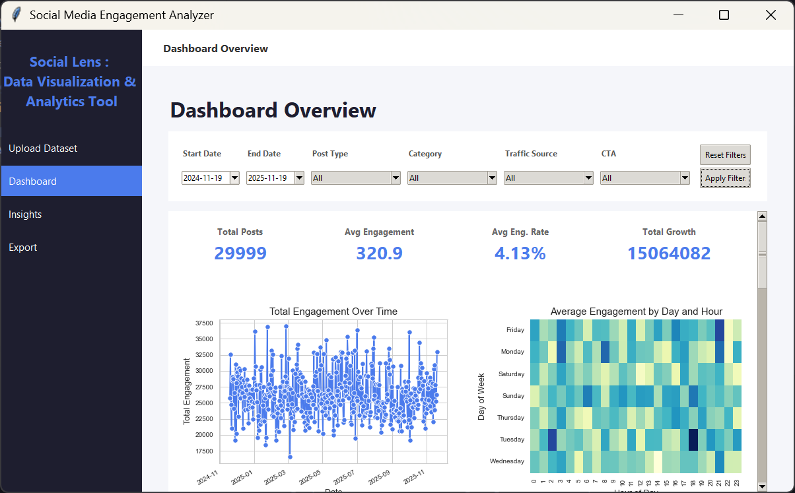
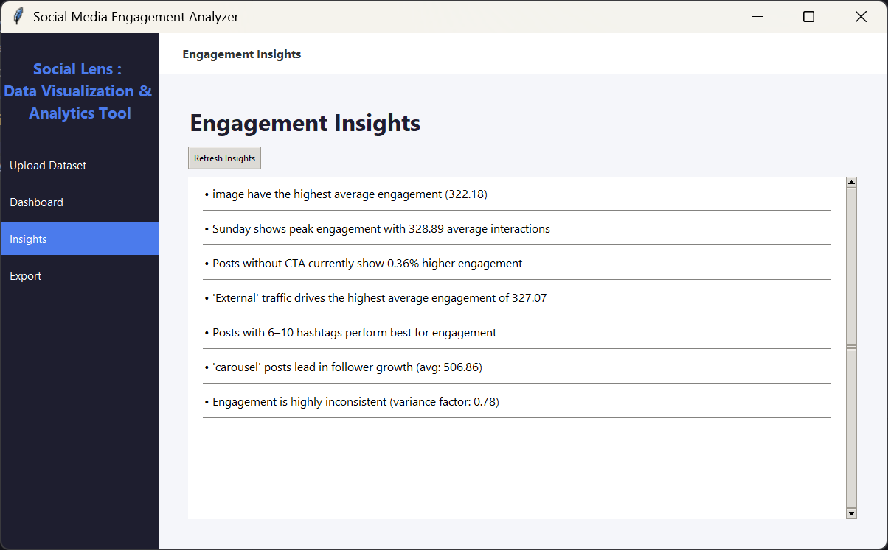
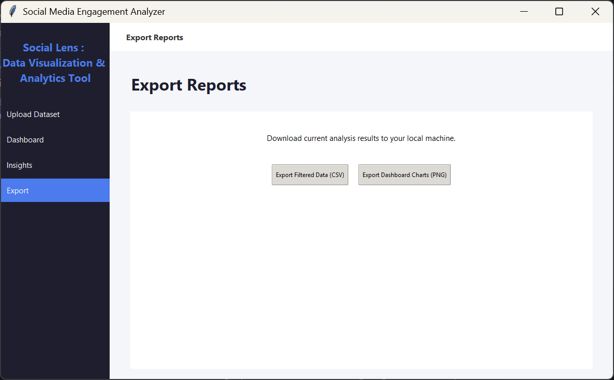
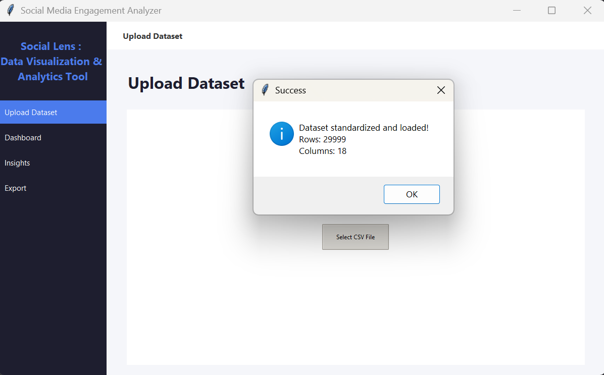

# Social Lens

Social Lens is a Python-based data visualization and analytics dashboard for exploring social media engagement. It ingests CSV data, cleans and standardizes it, and generates KPI scorecards, charts, and automated insights through an interactive desktop UI.

---

**Dataset Source (Kaggle)**  
**Dataset Name:** Instagram Analytics Dataset  
**Summary:** 29,999 Instagram posts with engagement metrics (likes, comments, shares, saves), reach/impressions, content metadata (media type, category, caption length, hashtags), account features, traffic source, posting time features, and a performance label.

**Ideal for:**
- Engagement prediction and classification (low/medium/high/viral)
- Best posting time analysis
- Traffic source impact analysis
- Content strategy optimization
- EDA and dashboarding

**What is included:**
- Post identifiers and timestamp features
- Engagement metrics and engagement rate
- Content category and media type
- Traffic source and CTA indicator
- Performance bucket label

**Dataset size:** 29,999 rows, 23 columns  
**Time span:** Nov 2024 - Nov 2025  
**Notes:** Some engagement fields include missing values (NaNs). You can impute or drop incomplete rows based on your modeling goals.  
**Link:** https://www.kaggle.com/datasets/kundanbedmutha/instagram-analytics-dataset

---

## Features

### 1. Dynamic Data Integration (Near Real-Time)
- Upload CSV files anytime; the dashboard updates instantly without restarting.
- Flexible enough to handle multiple social media schemas.

### 2. Robust Data Standardization
- **Automatic Schema Mapping:** Handles inconsistent column names (e.g., `reach` -> `impressions`, `favorites` -> `likes`).
- **Outlier Handling:** Caps extreme spikes using the IQR method.
- **Type Safety:** Converts strings to `datetime` and enforces numeric columns.
- **Feature Recovery:** Derives `day` and `hour` from `date` if missing.

### 3. Interactive Dashboard
- **KPI Scorecards:** Total Posts, Avg Engagement, Engagement Rate, Follower Growth.
- **10 Statistical Visualizations:**
  1. Engagement Over Time (Line)
  2. Daily Engagement Heatmap
  3. Avg Engagement by Post Type (Bar)
  4. Engagement Score Distribution by Post Type (Boxplot)
  5. Hashtag Count vs Score (Scatter + Regression)
  6. Caption Length vs Score (Scatter + Regression)
  7. CTA Comparison (Bar)
  8. Engagement by Traffic Source (Bar)
  9. Score Distribution + KDE (Histogram)
  10. Score vs Follower Growth (Scatter)
- **Seaborn-Powered Visuals:** Regression lines, KDE, and statistical styling.

### 4. Smart Filtering
- **Date Range Selection:** Uses `tkcalendar`.
- **Categorical Filters:** Post Type, Category, Traffic Source, CTA.
- **Instant Refresh:** Charts and insights update on apply.

### 5. Data-Driven Insights
- Auto-generated findings such as "Reels perform 28% better" and "Optimal hashtag count is 6-10".

### 6. Professional Reporting
- **Export Filtered Data:** Save to CSV.
- **Export Charts:** Batch-export all dashboard charts to PNG.

### 7. Standardized Analytics View
- Consistent professional titles and axis labels for every chart.

---

## Technology Stack

**Core Stack**
- Python, Tkinter, Pandas, NumPy
- Matplotlib, Seaborn
- SciPy (Pearson correlation)

**UI Components**
- `tkinter.ttk` (themed widgets)
- `tkcalendar.DateEntry` (date range picker)
- `FigureCanvasTkAgg` (embed Matplotlib in Tkinter)
- `tkinter.Canvas` + `ttk.Scrollbar` (scrollable chart container)
- `tkinter.filedialog` + `tkinter.messagebox` (uploads and alerts)

---

## Project Structure

```text
project/
+-- main.py                 # Core application, UI logic, control flow
+-- preprocessing.py        # Data pipeline (mapping, outliers, typing)
+-- insights_engine.py      # Statistical analysis and insight generation
+-- Dataset/                # Raw data directory
   +-- dva_project_dataset.csv
+-- assets/
   +-- screenshots/        # Project screenshots live here
        +-- dashboard.png
        +-- insights.png
        +-- export.png
        +-- upload.png
+-- README.md
```

---

## Installation and Setup

### 1. Prerequisites
Python 3.8+

### 2. Install Dependencies
```bash
pip install pandas matplotlib seaborn scipy tkcalendar
```

### 3. Run the App
```bash
python main.py
```

---

## How to Use

1. Import Data: Go to the **Upload** page and select your CSV file.
2. Explore Dashboard: View KPI cards and charts.
3. Refine Results: Apply filters (date range, category, traffic source, CTA).
4. Read Findings: Open the **Insights** page for recommendations.
5. Export Reports: Save filtered data or export chart images.

---

## Data Schema Requirements

Minimum required columns (aliases supported):
- `date` (or `created_at`, `post_date`)
- `likes` (or `favorites`)
- `comments` (or `replies`)
- `impressions` (or `views`, `reach`)

Automatically standardized if present:
- `shares`, `saves`, `post_type`, `category`, `traffic_source`, `cta`, `hashtags`, `followers_gained`

If `day` or `hour` are missing, they are derived from `date`.

---

## Screenshots

Store screenshots in `assets/screenshots/` and update the paths below.

**Recommended screenshots**
- `dashboard-kpis.png` (KPI scorecards and top charts)
- `dashboard-heatmap.png` (best time to post heatmap)
- `filters.png` (filter bar with date range and dropdowns)
- `insights.png` (auto-generated insights panel)
- `export.png` (export options and confirmation)
- `upload.png` (CSV upload flow)

Example Markdown:
```md




```

---

## Developed By

Puru Gupta
